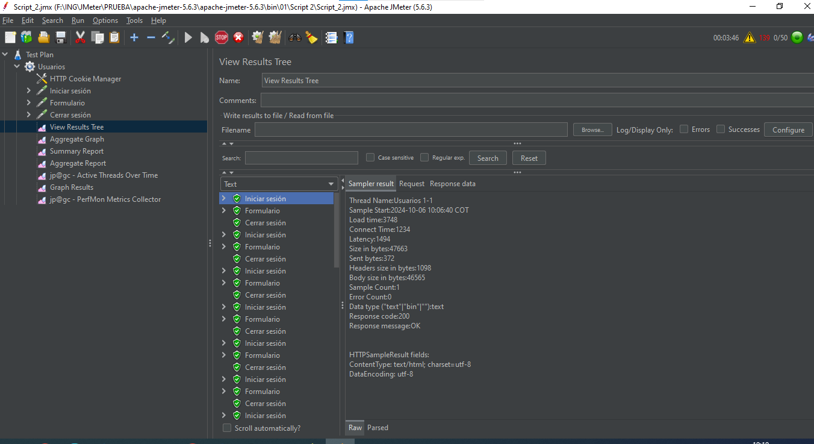
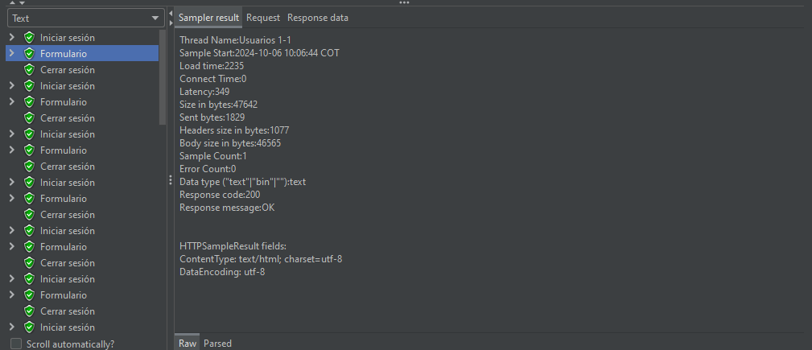
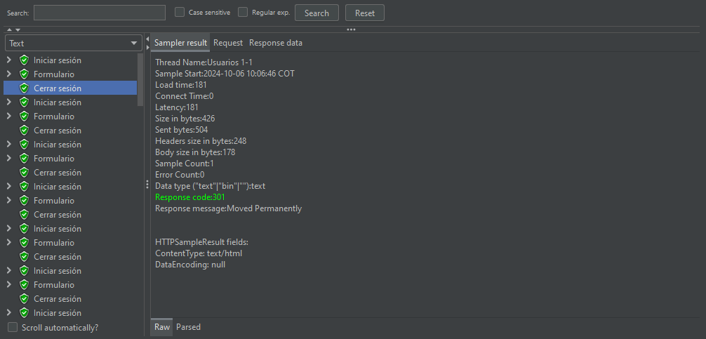
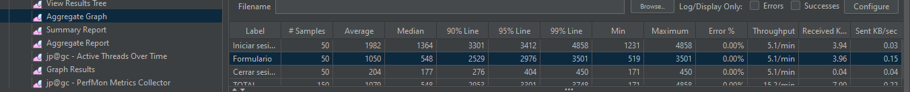
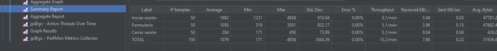
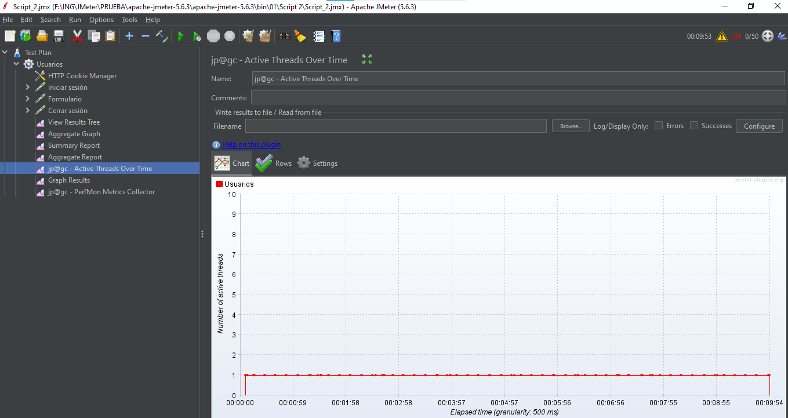
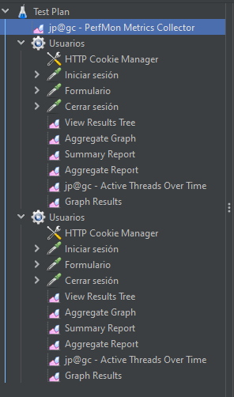
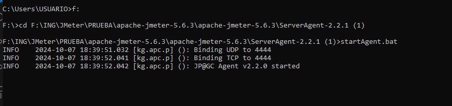
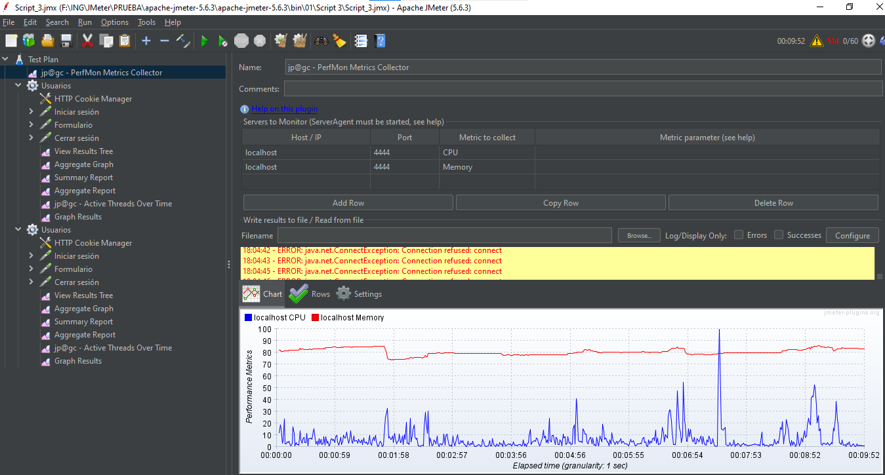
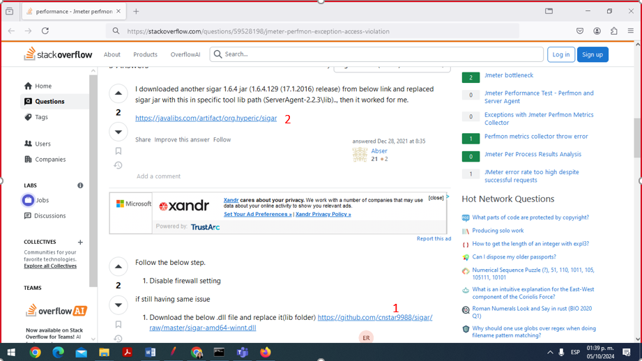

# Guía para Apache JMeter (5.6.3)
 ## Introducción ##

Este informe presenta los resultados de una serie de pruebas de rendimiento realizadas en
la aplicación mediante el uso de Apache JMeter. 

El objetivo principal fue medir el comportamiento de la aplicación bajo diferentes cargas, 
así como el consumo de recursos del sistema. Se realizaron dos pruebas específicas con un 
número creciente de usuarios concurrentes y una prueba adicional que combina los dos casos 
anteriores para obtener un análisis más detallado del consumo de memoria y procesador 
durante el período de prueba.

Las pruebas fueron ejecutadas desde la siguiente ruta en el sistema local:

F:\ING\JMeter\PRUEBA\apache-jmeter-5.6.3\apache-jmeter-5.6.3\bin


## Objetivos de las pruebas
- Evaluar el rendimiento de la aplicación en tres escenarios diferentes:
    - Inicio de sesión.
    - Operaciones dentro del formulario.
    - Cierre de sesión.

- Diferentes cargas de usuarios similares:
    - Prueba 1: 10 usuarios simultáneos por 180 segundos (3 minutos).
    - Prueba 2: 50 usuarios simultáneos por 600 segundos (10 minutos).

- Generar informes detallados para cada uno de los escenarios, incluyendo tiempos de respuesta
  y análisis del consumo de recursos del sistema:
    - CPU 
    - Memoria

- Centralizar los informes utilizando el PerFoms Plugin Collector para analizar de manera 
  integrada el consumo de recursos durante ambas pruebas.

- Estructura de los Scripts y Reportes Generados.

## El proyecto de JMeter está organizado de la siguiente manera:


- Script 1 y Script 2 se ejecutan por separado para simular la carga de 10 y 50 usuarios 
  respectivamente.
- Script 3 combina ambos scripts para analizar el consumo de recursos mediante el PerFoms 
  Plugin Collector 

# Paso a Paso de la Ejecución de las Pruebas
 ## 1. Crear un Test Plan Script 1


- **Usuarios**
  - **Thread Properties**
    - Number of Threads (users): 10
    - Ramp-up period (seconds): 180

### 1.1. Configuración de los Usuarios (Thread Group)
Abrir Apache JMeter:

Inicia la aplicación Apache JMeter.

Crear un Nuevo Test Plan:

Haz clic en "File" > "New" para crear un nuevo test plan.

Agregar un Thread Group:

Haz clic derecho en el Test Plan y selecciona Add > Threads (Users) > Thread Group.

Configurar las Propiedades del Thread Group:

Number of Threads (usuarios):

 - Valor: 10

Descripción: Este valor indica la cantidad de usuarios virtuales que simularás en la prueba.

En este caso, 10 usuarios estarán ejecutando las mismas solicitudes simultáneamente.

Ramp-up Period (seconds):

 - Valor: 180

Descripción: Este es el tiempo que JMeter tardará en iniciar todos los hilos (usuarios), 
en este caso, con un valor de 180 segundos, JMeter tomará 180 segundos para iniciar los 10 
usuarios; esto significa que se iniciará un nuevo usuario cada 18 segundos (180 segundos ÷ 
10 usuarios). Este enfoque permite simular un aumento gradual en la carga del servidor, 
evitando picos repentinos que podrían dar lugar a resultados engañosos.


## 2. Configurar HTTP Request para Login


Agregar HTTP Request:

Haz clic derecho en el Thread Group y selecciona
 - Add > Sampler > HTTP Request.

Configurar Web Server:

- Server Name or IP: demo.serenity.is

Configurar HTTP Request:

- Method: GET (o POST si se usa ese método para el login).

- Path: /Account/Login/?ReturnUrl=%2F
Agregar Parámetros:

En la pestaña Parameters:
- Name: demouser
- Value: admin
- Name: password
- Value: serenity


## 3. Configurar HTTP Request para Formulario


- Agregar HTTP Request:

- Haz clic derecho en el Thread Group y selecciona 

    -  Add > Sampler > HTTP Request.
    Configurar Web Server:

    - Protocol: http
    - Server Name or IP: demo.serenity.is
    - Configurar HTTP Request:
    - Method: POST
    - Path: Northwind/Supplier#edit/18


- Agregar Datos del Formulario:

En la pestaña Body Data (o Parameters, según la configuración del formulario):

  - Nombre de la empresa: [valor a ingresar]
  - Nombre de contacto: [valor a ingresar]
  - Título de contacto: [valor a ingresar]
  - Dirección: [valor a ingresar]
  - Región: [valor a ingresar]
  - Código postal: [valor a ingresar]
  - País: [valor a ingresar]
  - Ciudad: [valor a ingresar]
  - Teléfono: [valor a ingresar]
  - Fax: [valor a ingresar]

---

## 4. Configurar HTTP Request para Cerrar Sesión


- Agregar HTTP Request:

Haz clic derecho en el Thread Group y selecciona 
- Add > Sampler > HTTP Request.
Configurar HTTP Request:

- HTTP Request Name: Cerrar sesión

Configurar Web Server:

- Protocol: http
- Server Name or IP: demo.serenity.is

Configurar HTTP Request:

- Method: GET
- Path: Account/Signout


## 5. Ver Resultados


Agregar Listener para Ver Resultados:

Haz clic derecho en el Thread Group y selecciona 
- Add > Listener > View Results Tree.

Resultados Esperados:

- Iniciar sesión: Verifica que la solicitud de inicio de sesión se complete correctamente.
- Formulario: Asegúrate de que los datos del formulario se envíen correctamente y se reciban 
  respuestas adecuadas.
- Cerrar sesión: Confirma que la solicitud de cierre de sesión se ejecute sin errores.

Observa los resultados en el View Results Tree, donde podrás ver detalles de cada solicitud, incluyendo la respuesta del servidor.

## 6. Gráfico Agregado


Agregar Listener para Gráfico Agregado:

Haz clic derecho en el Thread Group y selecciona 
- Add > Listener > Aggregate Report o Aggregate Graph.

Resultados del Gráfico Agregado:

- Tiempo Total: Valor: 00:02:46

- Errores: Valor: 0
- Éxitos:Valor: 10


Visualización de Resultados


Durante la ejecución de la prueba de carga, se utilizó el listener "Aggregate Graph" para 
visualizar de forma gráfica los tiempos de respuesta de la aplicación, este gráfico proporcionó 
un resumen detallado de los éxitos, errores, y el tiempo total de ejecución del script.

Datos obtenidos:

Tiempo Total de Ejecución:

El tiempo total de la prueba fue de 00:02:46, esto representa el tiempo que tomó ejecutar todas 
las solicitudes realizadas por los usuarios concurrentes.

Errores:
0 errores fueron registrados durante la prueba, esto indica que todas las solicitudes realizadas 
por los usuarios concurrentes fueron procesadas correctamente por la aplicación sin fallos.

Éxitos: Se registraron 10 éxitos, lo que significa que todas las solicitudes configuradas en el 
script (como iniciar sesión, guardar datos y cerrar sesión) se completaron con éxito.

Conclusión: Los resultados del Aggregate Graph demuestran que la aplicación pudo manejar con 
éxito la carga simulada de usuarios concurrentes sin errores, con un tiempo total de ejecución 
de 2 minutos y 46 segundos, lo cual refleja una estabilidad adecuada de la aplicación 
bajo las condiciones de la prueba.

## Resultados del Summary Report
Se configuró el Summary Report en el script de JMeter para capturar los tiempos de respuesta y 
métricas clave en las transacciones de iniciar sesión, diligenciar el formulario y cerrar sesión.


Durante la ejecución de la prueba de carga, se utilizó el listener "Aggregate Graph" para 
visualizar de forma gráfica los tiempos de respuesta de la aplicación, este gráfico proporcionó 
un resumen detallado de los éxitos, errores, y el tiempo total de ejecución del script.

## Configuración:
Se añadió el Summary Report haciendo clic derecho sobre el Thread Group y seleccionando 
 - Add > Listener > Summary Report.

El listener recopiló estadísticas de las transacciones clave del script.

## Resultados:


Conclusión:
Los tiempos de respuesta fueron consistentes, con un promedio general de 1288 ms y 0% de errores
en todas las solicitudes, el sistema respondió de manera eficiente bajo la carga simulada de 
usuarios concurrentes.


### Resultados de Active Threads Over Time

El listener **"jp@gc - Active Threads Over Time"** en JMeter permite monitorear el número de 
hilos activos durante las pruebas de carga, proporcionando una visualización gráfica de cómo 
varían los usuarios concurrentes a lo largo del tiempo.


#### Propósito
- Visualizar en tiempo real la cantidad de hilos activos, identificando picos o caídas en el 
  rendimiento.

#### Configuración
1. **Agregar el Listener**: 
   - Haz clic derecho en el **Thread Group** y selecciona 
     **Add > Listener > jp@gc - Active Threads Over Time**.

#### Resultados del Gráfico
- **Número de hilos activos**: Varía de la siguiente manera durante la prueba con 10 usuarios 
    concurrentes:
  - 0, 1, 2, 3, 4 (inicio)
  - 6, 7, 8 (pico máximo)
  - 9, 10 (máximo alcanzado)

- **Gráfica de tiempo transcurrido**:
  - El eje X representa el tiempo transcurrido (granularidad: 500 ms).
  - El eje Y muestra el número de hilos activos.

#### Ejemplo de ejecución
- A los **00:00:00**, **4 hilos activos**.
- A los **00:01:42**, **10 hilos activos** (máximo).

#### Conclusión
Este listener es fundamental para analizar el rendimiento de la aplicación bajo carga y detectar
problemas potenciales. La gráfica permite identificar momentos críticos durante las pruebas.


### Informe: jp@gc - PerfMon Metrics Collector

El listener **"jp@gc - PerfMon Metrics Collector"** permite monitorear el uso de CPU y memoria 
durante las pruebas de carga en JMeter.

#### Resultados
- **Métricas recopiladas**: Uso de CPU y consumo de memoria.

#### Solución de Errores
En el **script 3**, se presentó un error relacionado con el rendimiento del sistema, se 
recomienda seguir los pasos del script 3 para resolverlo. 
A continuación, se muestra la imagen del error:


## Script 2: Duplicación del Script 1

El **script 2** fue creado duplicando el **script 1**, con la única modificación en la 
configuración de usuarios y tiempo; en este caso, se configuraron **50 usuarios concurrentes** 
para ejecutar el script durante **10 minutos**. Esto permite evaluar el rendimiento de la 
aplicación bajo una carga más alta y obtener un análisis comparativo con los resultados del 
**script 1**.


El **script 2**  mantiene la misma configuración para el inicio de sesión, el formulario y el
  cierre de sesión del **script 1**. 


### Resultados de la Ejecución del Script 2

Se presenta a continuación una captura de pantalla del **View Results Tree**, que muestra los 
resultados de la ejecución del script, en esta imagen, todos los resultados se presentan en 
color verde, lo que indica que todas las solicitudes fueron procesadas correctamente y no se 
encontraron errores durante la prueba.



Esta visualización es esencial para validar que el script se comportó como se esperaba, y que la
aplicación logró manejar la carga de usuarios concurrentes sin problemas. La ausencia de errores 
es un indicativo positivo del rendimiento y estabilidad del sistema bajo las condiciones de 
prueba establecidas.



### Resultados del Aggregate Graph

El **Aggregate Graph** proporciona una visualización detallada del rendimiento del script durante
la ejecución con 50 usuarios concurrentes, a continuación se presentan los resultados más 
destacados:

- **Iniciar Sesión**:
  - **Número de muestras**: 50
  - **Tiempo promedio**: 1982 ms
  - **Máximo**: 4858 ms
  - **Porcentaje de errores**: 0.00%
  - **Throughput**: 5.1/min

- **Formulario**:
  - **Número de muestras**: 50
  - **Tiempo promedio**: 1050 ms
  - **Máximo**: 3501 ms
  - **Porcentaje de errores**: 0.00%
  - **Throughput**: 5.1/min

- **Cerrar Sesión**:
  - **Número de muestras**: 50
  - **Tiempo promedio**: 204 ms
  - **Máximo**: 450 ms
  - **Porcentaje de errores**: 0.00%
  - **Throughput**: 5.1/min

Estos resultados indican que la aplicación manejó correctamente la carga de 50 usuarios 
concurrentes, con un rendimiento aceptable y sin errores registrados, los tiempos de respuesta 
se mantienen dentro de un rango razonable, lo que sugiere que el sistema está optimizado para 
manejar este volumen de solicitudes.


## Resultados del Summary Report
El Summary Report proporciona una visión general del rendimiento del sistema al realizar pruebas
con 50 usuarios concurrentes; a continuación se presentan los resultados obtenidos:


Estos resultados indican que la aplicación se desempeñó sin errores durante las pruebas, con 
tiempos de respuesta promedio que se mantuvieron dentro de rangos aceptables, lo que sugiere 
que el sistema puede manejar adecuadamente la carga de 50 usuarios concurrentes.


El **jp@gc - Active Threads Over Time** proporciona una visualización del número de hilos activos
durante la ejecución del **Script 2** en JMeter; a continuación, se detallan los aspectos 
relevantes de este informe:

- **Número de Hilos Activos**: Se observó un máximo de **10 hilos activos**, lo que indica que la
    carga de trabajo fue manejada de manera eficiente a lo largo del tiempo.
- **Duración de la Prueba**: La prueba se ejecutó durante un total de 
  **9 minutos y 53 segundos**, lo que permite evaluar el comportamiento de la aplicación bajo 
  carga durante un periodo prolongado.

La gráfica muestra un control efectivo sobre la cantidad de usuarios concurrentes durante la 
ejecución del script, lo cual es esencial para identificar la capacidad de respuesta y la 
estabilidad del sistema bajo pruebas.

# Script 3: Pruebas de CPU y Memoria con PerfMon Metrics Collector

Este **script 3** combina los scripts anteriores, ejecutando pruebas adicionales de rendimiento
de CPU y memoria mediante el **PerfMon Metrics Collector**, a continuación, se detalla el 
proceso para crear y ejecutar el script.

### Paso a paso para crear y ejecutar el Script 3:

1. **Configurar el Test Plan**:
   - Incluir las secciones de **Iniciar sesión**, **Formulario**, y **Cerrar sesión**, similares
     a los scripts anteriores.
   - Agregar el listener **jp@gc - PerfMon Metrics Collector** para monitorear el uso de CPU y 
     memoria del servidor.
   - Configurar **10 usuarios concurrentes** y **50 usuarios concurrentes** y establecer el 
     tiempo de duración de la prueba, asegurando una carga representativa del sistema.
   



2. **Ejecutar las pruebas desde el cmd**:
   - Iniciar el **Server Agent** ejecutando el archivo **`startAgent.bat`** en la carpeta 
     donde está instalado el **PerfMon Server Agent**:
     ```bash
     startAgent.bat
     ```
     
     Esto lanzará el agente necesario para recopilar las métricas de CPU y memoria desde el 
     servidor durante la ejecución de las pruebas.

3. **Verificación de la gráfica**:
   - Revisar la gráfica generada por **PerfMon Metrics Collector** en el listener para 
     verificar el comportamiento del CPU y memoria. 
   


## Descripción General de la Gráfica
- **Eje Y (Performance Metrics)**: Representa el porcentaje de uso de CPU (en azul) y de memoria
  (en rojo).
- **Eje X (Elapsed time)**: Indica el tiempo transcurrido en la prueba (con granularidad de 1 
  segundo).

## Análisis del Uso de CPU
- La línea azul muestra las fluctuaciones del **uso de CPU** a lo largo del tiempo.
- En general, el uso de la CPU está relativamente bajo, con algunos picos que superan el 20%, 
  pero la mayor parte del tiempo se mantiene en valores bajos, por debajo del 10%.
- Hay algunos picos significativos alrededor del minuto 6, lo que indica momentos de mayor 
  demanda de procesamiento en esos intervalos específicos.

## Análisis del Uso de Memoria
- La línea roja indica el **uso de memoria** del servidor.
- A lo largo de toda la prueba, el uso de memoria se mantiene muy constante en torno al 85-90%,
  esto indica que el sistema está utilizando una gran parte de su memoria disponible, lo cual 
  podría ser un factor a monitorear, ya que una memoria constantemente alta podría significar 
  que el sistema está cerca de su límite de capacidad de memoria.

## Recomendaciones
1. **CPU**: Aunque hay picos de uso de CPU, en general, el rendimiento de la CPU no parece 
estar siendo un problema, ya que los valores son bastante bajos la mayoría del tiempo; los 
picos observados no parecen críticos, pero podrían deberse a tareas específicas del servidor 
durante la prueba.
   
2. **Memoria**: El uso constante de memoria alrededor del 85-90% es algo que debe 
considerarse, aunque el sistema sigue funcionando, este nivel tan alto sugiere que la 
memoria está bastante ocupada; si el uso de memoria sigue en aumento, podría generar problemas
de rendimiento.


 ## Si no se genera la gráfica o los resultados no se visualizan correctamente, podría deberse a un problema con la conexión al **Server Agent**.


4. **Solución a posibles problemas**:
   - Si no se ve la gráfica o aparece un error de conexión con el **Server Agent**, es posible
     que la versión del **Server Agent** esté causando el problema, para solucionarlo siga los 
     siguientes pasos:
 
     1. **Descargar la .DLL** correspondiente desde [este enlace en StackOverflow](https://stackoverflow.com/questions/59528198/jmeter-perfmon-exception-access-violation).
    
     2. Colocar la **.DLL** en la carpeta de instalación del **Server Agent**.
     
     3. Reiniciar el **Server Agent** ejecutando nuevamente el **`startAgent.bat`** y volver a correr las pruebas.
